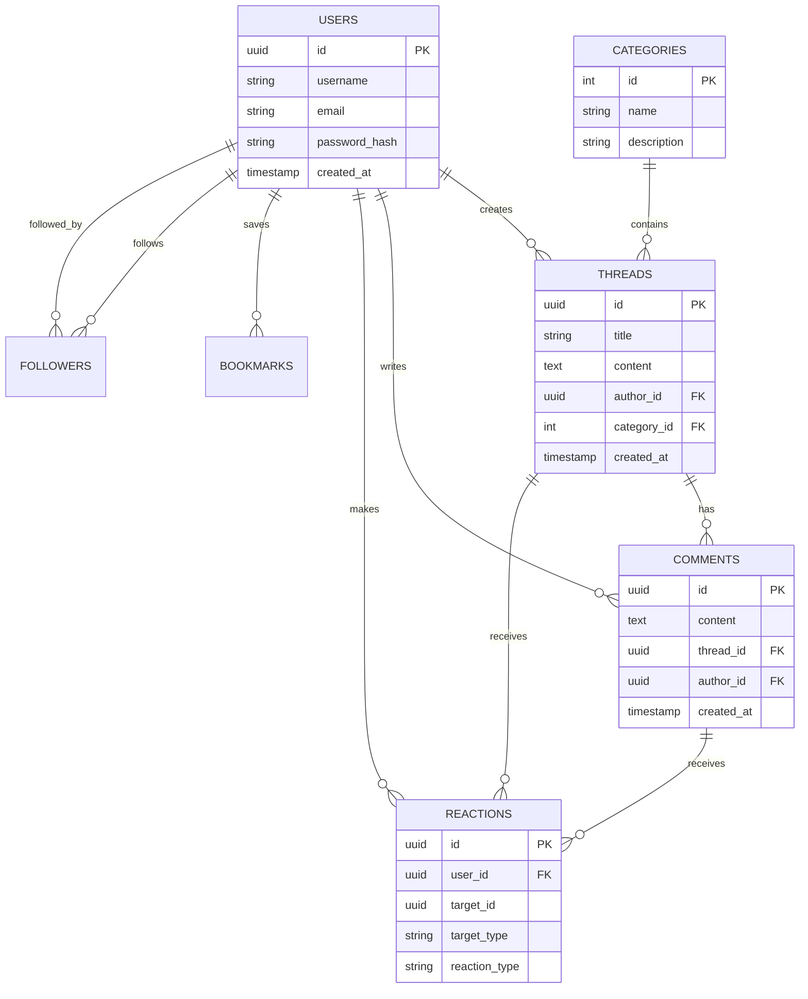
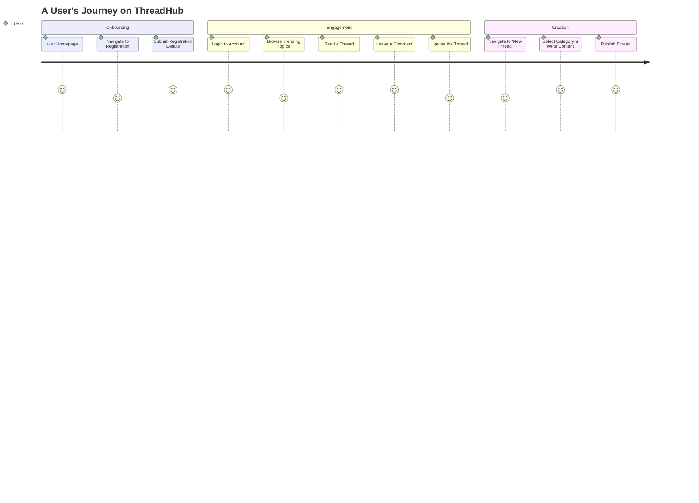
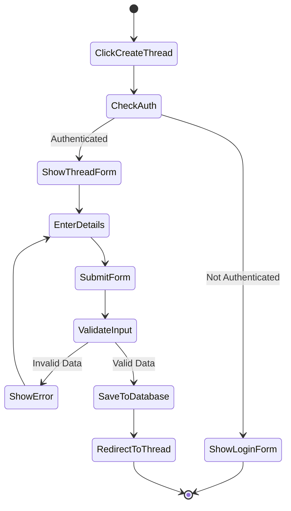
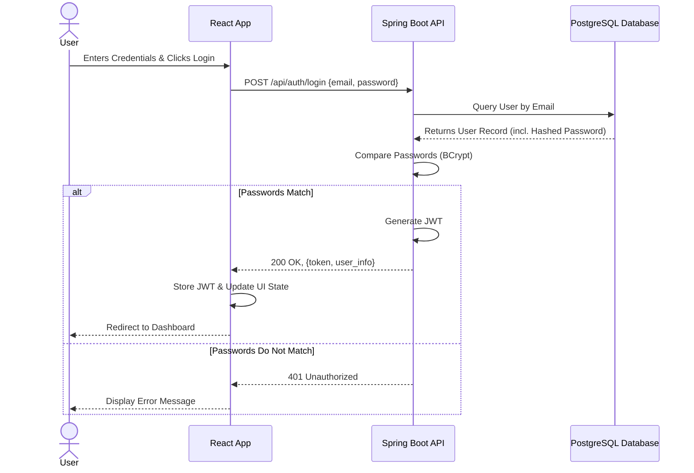
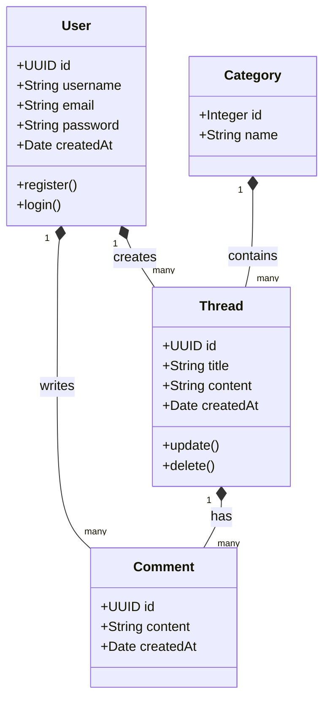
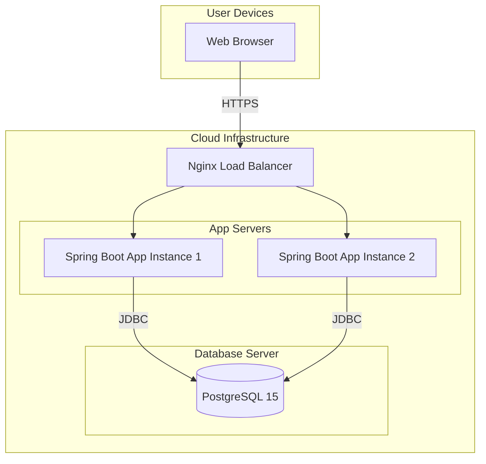
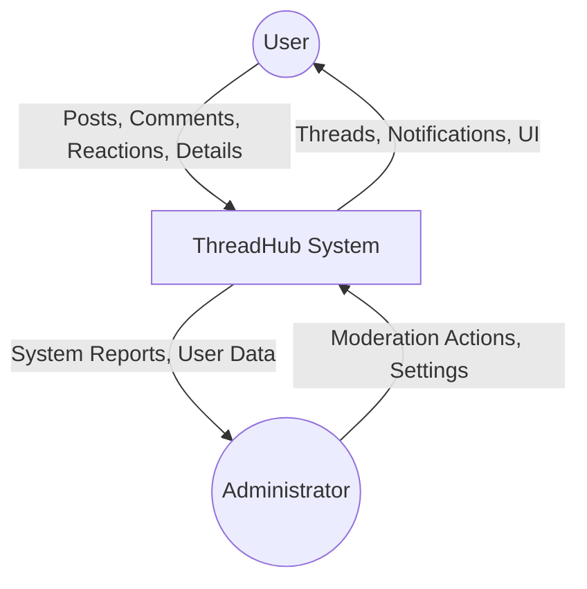
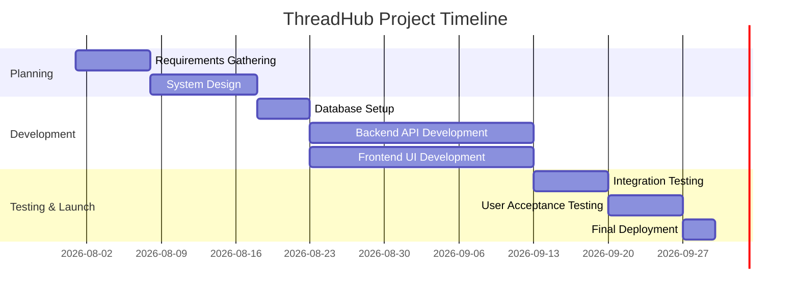

# ThreadHub: Modern Online Community Discussion Forum
**Project Documentation**

---

## 1. Cover Page

**Project Title:** ThreadHub - A Modern Online Community Discussion Forum
**Project Type:** Software Engineering Project Documentation
**Author:** Software Engineering Team
**Date:** August 2026
**Institution/Organization:** [University/Organization Name]

---

## 2. Table of Contents

1. Cover Page
2. Table of Contents
3. Abstract
4. Introduction
5. Background of the Study
6. Problem Statement
7. Aim of the Project
8. Objectives
9. Scope of the Project
10. Limitations
11. Literature Review
12. System Analysis
13. Functional Requirements
14. Non-functional Requirements
15. Software Requirements
16. Hardware Requirements
17. System Architecture
18. Database Design
19. System Design
20. Features of ThreadHub
21. Security Features
22. Workflow of the System
23. User Journey
24. Testing
25. Future Improvements
26. Challenges Encountered
27. Conclusion
28. Recommendations
29. References
30. Appendix

---

## 3. Abstract

The advent of Web 2.0 has facilitated unprecedented levels of global connectivity, yet many existing online discussion forums suffer from archaic user interfaces, sluggish performance, and inadequate community moderation tools. This project details the design, development, and evaluation of **ThreadHub**, a modern, responsive, and highly interactive online community discussion forum. Built upon a robust technological stack comprising React.js for the frontend, Java (Spring Boot) for the backend, and PostgreSQL for the relational database, ThreadHub aims to foster meaningful digital conversations. The platform integrates essential features such as secure user authentication, threaded discussions, real-time reactions, user-following mechanisms, and dynamic trending topic discovery. By adhering to clean architecture principles and stringent security protocols, ThreadHub delivers a scalable and maintainable solution that addresses the deficiencies of legacy forum platforms, thereby providing users with a premium, engaging, and secure communication environment.

---

## 4. Introduction

In the contemporary digital era, online communities serve as vital hubs for knowledge exchange, networking, and social interaction. Forums have historically been the backbone of this digital discourse. However, as user expectations have evolved, the demand for platforms offering seamless navigation, aesthetically pleasing interfaces, and real-time interactions has surged. ThreadHub is conceptualised to meet these demands by providing a sophisticated discussion platform that prioritises user experience (UX) and system performance. This documentation provides a comprehensive overview of the ThreadHub project, chronicling its development lifecycle from initial conceptualisation and requirements engineering to system architecture, implementation, and rigorous testing.

---

## 5. Background of the Study

The evolution of digital communication has transitioned from rudimentary bulletin board systems (BBS) to complex, algorithm-driven social media platforms. Despite the proliferation of the latter, dedicated discussion forums remain indispensable for in-depth, topic-centric conversations. Traditional forums, however, often utilise monolithic architectures that hinder scalability and adaptability. The need for a modernised approach is evident—one that leverages contemporary web technologies such as Single Page Applications (SPAs) and RESTful Application Programming Interfaces (APIs). ThreadHub is developed against this backdrop, seeking to amalgamate the focused discourse of traditional forums with the fluidity and responsiveness characteristic of modern social networking applications.

---

## 6. Problem Statement

Existing discussion platforms frequently exhibit one or more of the following critical deficiencies:
1. **Outdated User Interfaces:** Many forums rely on legacy designs that are neither intuitive nor responsive across diverse devices, leading to suboptimal user engagement.
2. **Performance Bottlenecks:** Monolithic architectures and inefficient database querying often result in high latency, particularly during peak traffic periods.
3. **Inadequate Content Discovery:** Users frequently struggle to identify relevant or trending discussions due to poor categorisation and search functionalities.
4. **Security Vulnerabilities:** Insufficient implementation of modern security standards leaves platforms susceptible to attacks such as Cross-Site Scripting (XSS) and SQL Injection.
ThreadHub seeks to resolve these issues by architecting a platform that is inherently secure, highly performant, and designed with a meticulous focus on modern UI/UX paradigms.

---

## 7. Aim of the Project

The primary aim of this project is to design, develop, and deploy a state-of-the-art online community discussion forum (ThreadHub) that facilitates engaging, secure, and well-organised digital conversations, thereby providing a superior alternative to legacy forum software.

---

## 8. Objectives

To achieve the overarching aim, the following specific objectives have been established:
- To design a highly responsive, modern, and accessible user interface using React.js.
- To develop a scalable and robust backend RESTful API utilising Java (Spring Boot).
- To implement a secure relational database schema using PostgreSQL to manage users, threads, comments, and interactions efficiently.
- To integrate comprehensive security measures, including robust authentication (e.g., JWT), password hashing, and protection against common web vulnerabilities.
- To implement advanced platform features such as real-time trending algorithms, user following, bookmarks, and rich-text thread creation.
- To conduct rigorous unit, integration, and user acceptance testing to ensure system reliability and performance.

---

## 9. Scope of the Project

The scope of ThreadHub encompasses the development of the core forum functionalities. This includes user registration and profile management, the creation and management of categories, threads, and comments, as well as interaction mechanisms such as reactions and bookmarks. The project also covers the implementation of an administrative dashboard for content moderation and user management. Geographically and demographically, the platform is designed to be universally accessible, catering to any community requiring a digital discussion space. 

---

## 10. Limitations

While ThreadHub is designed to be comprehensive, certain limitations exist within the current project scope:
- **Real-Time Communication:** The current iteration does not support real-time WebSocket-based private messaging; interactions are asynchronous.
- **Media Hosting:** Due to infrastructure constraints, the platform relies on external CDNs or limited local storage for image hosting within threads.
- **Advanced AI Moderation:** The system currently relies on human moderation and keyword filtering, lacking sophisticated AI-driven sentiment analysis for automatic toxic content removal.

---

## 11. Literature Review

### Online Forums and Social Communities
Digital forums have long been the cornerstone of internet communities. Studies indicate that structured, topic-based forums foster higher quality discourse compared to the ephemeral nature of microblogging platforms. The persistence of data allows for the creation of vast knowledge repositories.

### Existing Platforms (Reddit, X, Facebook Groups, Quora, Discord)
- **Reddit:** Utilises a subreddit structure allowing for niche communities. However, its complex interface can be daunting for new users.
- **X (formerly Twitter):** Excels in real-time updates but is ill-suited for deep, structured, and persistent discussions.
- **Facebook Groups:** Leverages existing social graphs but suffers from limited searchability and algorithmic feed manipulation that obscures chronological discourse.
- **Quora:** Focuses strictly on Q&A, lacking the conversational fluidity of a standard forum.
- **Discord:** Provides excellent real-time chat but is inherently synchronous, making it difficult to track long-term, asynchronous topics.

### Why ThreadHub?
ThreadHub amalgamates the structured, categorical approach of traditional forums with the aesthetic and functional fluidity of modern web applications. By eschewing algorithmic timeline manipulation in favour of user-curated discovery and trending metrics, ThreadHub ensures that content visibility is driven by authentic community engagement rather than opaque algorithms.

---

## 12. System Analysis

System analysis for ThreadHub involved a meticulous examination of user needs and technical feasibility. The analysis phase determined that a client-server architecture, specifically a decoupled SPA (Single Page Application) and a RESTful API backend, was the most appropriate approach. This decoupling allows for independent scaling of the frontend and backend and facilitates potential future developments, such as native mobile applications.

---

## 13. Functional Requirements

Functional requirements define the specific behaviours and functions the system must support:
- **User Management:** Users must be able to register, log in, update profiles, and follow/unfollow other users.
- **Content Creation:** Authenticated users shall be able to create, edit, and delete threads and comments.
- **Categorisation:** Threads must be assignable to specific predefined categories.
- **Engagement:** Users must be able to react (e.g., like/dislike) to threads and comments, and bookmark threads for future reference.
- **Discovery:** The system must provide a search mechanism to find threads by title or content, and display a dynamic list of trending topics.
- **Notifications:** Users shall receive notifications for replies to their threads, comments, and new followers.
- **Moderation:** Administrators must possess the capability to delete inappropriate content and suspend user accounts.

---

## 14. Non-functional Requirements

Non-functional requirements specify the criteria that judge the operation of the system:
- **Performance:** The system should load the initial frontend payload in under 2 seconds. API responses should average under 200 milliseconds.
- **Scalability:** The backend architecture must be stateless to allow horizontal scaling behind a load balancer.
- **Security:** All user passwords must be hashed using a strong cryptographic algorithm (e.g., BCrypt). Data in transit must be encrypted via HTTPS/TLS.
- **Usability:** The user interface must be fully responsive, adhering to WCAG 2.1 AA accessibility standards, ensuring compatibility across mobile, tablet, and desktop devices.
- **Reliability:** The system should target an uptime of 99.9%, with automated database backups performed daily.

---

## 15. Software Requirements

- **Frontend:** React.js, React Router, Axios, CSS3/TailwindCSS (for styling), Vite (Build Tool).
- **Backend:** Java 17+, Spring Boot, Spring Security, Spring Data JPA, Hibernate.
- **Database:** PostgreSQL 15+.
- **Version Control:** Git, GitHub.
- **Development Environment:** Visual Studio Code (VS Code), IntelliJ IDEA (optional for Java).
- **API Testing:** Postman / Insomnia.

---

## 16. Hardware Requirements

**Development Machine:**
- Processor: Intel Core i5 / AMD Ryzen 5 or higher.
- RAM: Minimum 8 GB (16 GB recommended).
- Storage: 256 GB SSD minimum.

**Production Server (Minimum Specifications):**
- Processor: 2 vCPUs.
- RAM: 4 GB.
- Storage: 50 GB SSD.
- Operating System: Ubuntu 22.04 LTS (or similar Linux distribution).

---

## 17. System Architecture

ThreadHub employs a modern Three-Tier Architecture:
1. **Presentation Tier (Client):** A React.js Single Page Application running in the user's browser, responsible for UI rendering and user interaction.
2. **Application Tier (Server):** A Java Spring Boot REST API that processes business logic, handles authentication, and orchestrates data access.
3. **Data Tier (Database):** A PostgreSQL relational database storing all persistent data.

```mermaid
flowchart TD
    Client[React.js Frontend (Browser)] <-->|HTTPS / JSON| LoadBalancer[Reverse Proxy / Load Balancer]
    LoadBalancer <--> API[Java Spring Boot Backend API]
    API <-->|JDBC / Hibernate| Database[(PostgreSQL Database)]
```

---

## 18. Database Design

### Explain Every Table
- **Users:** Stores user credentials and profile information.
- **Categories:** Defines the broad topics under which threads are organised.
- **Threads:** Represents the main discussion posts created by users.
- **Comments:** Stores replies associated with specific threads.
- **Reactions:** Records user likes/dislikes on threads and comments.
- **Bookmarks:** Tracks which threads a user has saved.
- **Followers:** A junction table managing the many-to-many relationship of users following other users.

### Relationships
- One **User** can create multiple **Threads** (1:N).
- One **Category** can contain multiple **Threads** (1:N).
- One **Thread** can have multiple **Comments** (1:N).
- One **User** can leave multiple **Comments** (1:N).
- **Followers** is a recursive many-to-many relationship on the Users table.

### ER Diagram Description
The ER diagram illustrates the entities and their interconnections. The central entities are `User` and `Thread`. A `User` acts as a primary key referenced as a foreign key in `Thread`, `Comment`, `Reaction`, and `Bookmark`. This ensures referential integrity across the system.



---

## 19. System Design

### UI Design
The UI is designed with a "mobile-first" philosophy. It utilises a clean, modern aesthetic characterised by ample whitespace, a consistent colour palette tailored for readability, and distinct typographic hierarchy. A dark mode toggle is integrated to enhance accessibility and user preference.

### Navigation Flow
1. **Unauthenticated:** Landing Page -> Login / Registration -> Browse Categories (Read Only).
2. **Authenticated:** Dashboard (Trending/Feed) -> Create Thread / View Profile / Browse Categories -> Thread Detail View -> Post Comment / React.

### User Roles
- **Guest:** Can view threads, comments, and categories, but cannot interact or post.
- **Registered User:** Can create threads, comment, react, follow users, and manage their profile.
- **Administrator:** Possesses all Registered User privileges, plus the ability to manage categories, delete any thread/comment, and suspend users.

---

## 20. Features of ThreadHub

- **Authentication:** Secure login and registration using JWT (JSON Web Tokens). Passwords are never stored in plaintext.
- **Create/Edit/Delete Thread:** Rich text editing capabilities for expressive post creation. Users retain full control over their content.
- **Categories:** Organised community spaces ensuring discussions remain on-topic and easily discoverable.
- **Comments & Replies:** Nested or chronological discussion flows beneath main threads.
- **Reactions:** Immediate feedback mechanisms (upvote/downvote or likes) fostering community consensus.
- **Bookmarks:** A personal repository for users to save threads for future reading.
- **Search & Discover:** Full-text search capabilities allowing users to find specific topics rapidly.
- **Notifications:** In-app alerts informing users of interactions with their content.
- **User Profiles:** Customisable spaces showcasing a user's activity, joined date, and avatar.
- **Follow Users:** Establishing personal networks within the broader community to tailor the content feed.
- **Trending Topics:** An algorithmic display of currently popular threads based on recent engagement metrics.
- **Responsive Design:** Flawless operation across all screen sizes, from mobile phones to ultra-wide desktop monitors.

---

## 21. Security Features

Security is paramount in ThreadHub's architecture:
- **Password Encryption:** Utilisation of BCrypt hashing algorithm with a high work factor to thwart brute-force and rainbow table attacks.
- **Authentication & Authorization:** JWT-based stateless authentication. Role-Based Access Control (RBAC) ensures users can only perform actions permitted by their role.
- **Input Validation:** Strict server-side validation of all incoming data using Spring Boot Validation annotations to prevent malformed data entry.
- **SQL Injection Prevention:** Exclusive use of JPA/Hibernate and parameterized queries completely mitigates SQL injection risks.
- **XSS Prevention:** React.js inherently escapes variables by default, protecting against Cross-Site Scripting. Further sanitisation is applied to any rendered rich text.
- **CORS Configuration:** Strict Cross-Origin Resource Sharing policies to ensure the API only accepts requests from trusted frontend domains.

---

## 22. Workflow of the System

The system operates on an event-driven request-response model:
1. The user interacts with the React frontend (e.g., clicks "Submit Post").
2. The frontend formulates an asynchronous HTTP request (e.g., POST `/api/threads`) containing the payload and the user's JWT in the Authorization header.
3. The Spring Boot backend intercepts the request, validates the JWT, and authorises the user.
4. The backend validates the payload.
5. The backend interacts with the PostgreSQL database to persist the new thread.
6. The backend returns an HTTP 201 Created response to the frontend.
7. The frontend updates the UI dynamically without a full page reload, displaying the newly created thread.

---

## 23. User Journey



---

## 24. Testing

Robust testing strategies were employed to ensure software quality:
- **Unit Testing:** Utilising JUnit and Mockito for the backend to test individual service methods in isolation. Jest and React Testing Library were used for frontend components.
- **Integration Testing:** Testing the interaction between the Spring Boot application and a test PostgreSQL database using Spring Boot Test.
- **UI Testing:** Manual and automated testing (e.g., Cypress) to ensure frontend components render correctly and user flows function as expected.
- **User Acceptance Testing (UAT):** Beta testing conducted with a select group of users to validate that the software meets business requirements and is intuitive to use.

---

## 25. Future Improvements

Continuous evolution is planned for ThreadHub. Future iterations will aim to incorporate:
- **Real-Time Chat:** Implementing WebSockets for direct, user-to-user private messaging.
- **Advanced Media Handling:** Integration with cloud storage (e.g., AWS S3) for seamless image and video uploads within threads.
- **Mobile Application:** Developing native iOS and Android applications using React Native to expand accessibility.
- **Gamification:** Introducing badges, reputation scores, and achievements to further incentivize positive community engagement.

---

## 26. Challenges Encountered

During the development lifecycle, several challenges were addressed:
- **State Management:** Managing complex state in the React frontend (e.g., user authentication status, cached thread data) required careful implementation of Context API/Redux to avoid prop-drilling and unnecessary re-renders.
- **Database Query Optimisation:** As the volume of relational data grew, retrieving complex threaded comments necessitated the optimisation of JPA queries and the introduction of database indexing to maintain low latency.
- **CORS and Security Configuration:** Properly configuring Spring Security to handle pre-flight requests and JWT validation seamlessly with the frontend required extensive debugging.

---

## 27. Conclusion

The ThreadHub project successfully culminated in the development of a modern, robust, and highly functional online community discussion forum. By strategically employing a decoupled architecture with React.js and Java Spring Boot, the platform achieves a synthesis of high performance, stringent security, and an exceptional user experience. ThreadHub not only addresses the shortcomings of legacy forum software but also provides a scalable foundation capable of supporting a growing and dynamic digital community.

---

## 28. Recommendations

Based on the project's outcomes, it is recommended that:
- Organisations seeking to deploy custom community platforms consider the decoupled SPA/REST API architecture utilised herein, as it offers superior maintainability.
- Continuous monitoring and logging (e.g., using ELK stack) be implemented in production environments to proactively identify and resolve potential issues.
- Community guidelines and human moderation protocols be established prior to public launch, as technological solutions alone cannot wholly govern user behaviour.

---

## 29. References

1. Fowler, M. (2002). *Patterns of Enterprise Application Architecture*. Addison-Wesley Professional.
2. React Documentation. (2026). *React: A JavaScript library for building user interfaces*. Retrieved from https://react.dev/
3. Spring Boot Reference Guide. (2026). *Spring Boot*. VMware. Retrieved from https://spring.io/projects/spring-boot
4. PostgreSQL Global Development Group. (2026). *PostgreSQL Documentation*. Retrieved from https://www.postgresql.org/docs/
5. OWASP Foundation. (2026). *OWASP Top Ten Web Application Security Risks*. Retrieved from https://owasp.org/www-project-top-ten/

---

## 30. Appendix

### 30.1 Additional Diagrams

#### Use Case Diagram
```mermaid
flowchart LR
    Guest((Guest))
    User((Registered User))
    Admin((Administrator))

    Guest --> (View Threads)
    Guest --> (Register/Login)
    Guest --> (Search)

    User --> (Create Thread)
    User --> (Post Comment)
    User --> (React to Content)
    User --> (Bookmark Thread)
    User --> (Follow User)
    User --> (Edit Profile)

    Admin --> (Delete Any Thread)
    Admin --> (Manage Categories)
    Admin --> (Suspend User)

    User -.-> Guest : Inherits
    Admin -.-> User : Inherits
```

#### Activity Diagram (Creating a Thread)


#### Sequence Diagram (User Login)


#### Class Diagram (Backend Entities)


#### Deployment Diagram


#### Data Flow Diagram (Level 0 - Context Diagram)


#### Data Flow Diagram (Level 1 - Main Processes)
```mermaid
flowchart TD
    User((User))
    P1(1.0 Auth & Profile)
    P2(2.0 Thread Management)
    P3(3.0 Interaction)
    D1[(Users DB)]
    D2[(Threads DB)]
    D3[(Interactions DB)]

    User -->|Credentials| P1
    P1 <--> D1
    
    User -->|Thread Data| P2
    P2 <--> D2
    P2 -.-> P1 : Auth Check
    
    User -->|Comments/Reactions| P3
    P3 <--> D3
    P3 -.-> P2 : Reference Thread
```

#### Gantt Chart (Project Timeline)


### 30.2 Additional Documentation Documents

#### Sitemap
- **/** (Home / Landing Page)
- **/login** (User Login)
- **/register** (User Registration)
- **/dashboard** (Authenticated User Feed / Trending)
- **/categories** (List of all Categories)
  - **/categories/{id}** (Threads within a specific Category)
- **/thread/{id}** (Thread Detail View & Comments)
- **/thread/new** (Create New Thread Form)
- **/profile/{username}** (User Profile Page)
  - **/profile/settings** (Profile Configuration)
- **/admin/dashboard** (Administrator Panel)

#### Wireframes (Text Representation)
**Home Page Wireframe:**
```text
+---------------------------------------------------------+
| [Logo] ThreadHub    Search...      [Login] [Register]   |
+---------------------------------------------------------+
|                                                         |
|  +-----------------+  +------------------------------+  |
|  | Categories      |  | Trending Threads             |  |
|  | - Technology    |  |                              |  |
|  | - Science       |  | 1. The Future of AI (45 cmt) |  |
|  | - Entertainment |  | 2. Web Dev in 2026 (30 cmt)  |  |
|  | - Gaming        |  | 3. Space Exploration (12 cmt)|  |
|  +-----------------+  +------------------------------+  |
|                                                         |
+---------------------------------------------------------+
| Footer: About | Contact | Terms of Service              |
+---------------------------------------------------------+
```

**Thread Detail View Wireframe:**
```text
+---------------------------------------------------------+
| [Logo] ThreadHub    Search...      [Avatar] [Profile]   |
+---------------------------------------------------------+
| [<- Back to Category]                                   |
|                                                         |
|  Title: The Future of AI in Software Engineering        |
|  By: @TechGuru  |  2 hours ago                          |
|  -----------------------------------------------------  |
|  Content of the thread goes here. Explaining the        |
|  various impacts of LLMs on coding...                   |
|                                                         |
|  [ Upvote (142) ] [ Downvote (12) ] [ Bookmark ]        |
|  =====================================================  |
|  Comments (45)                                          |
|                                                         |
|  +---------------------------------------------------+  |
|  | [Your Avatar] [ Text area to add a comment... ]   |  |
|  | [ Submit Comment ]                                |  |
|  +---------------------------------------------------+  |
|                                                         |
|  @DevEnthusiast: Great insights! I entirely agree.      |
|  [Reply] [Upvote(10)]                                   |
+---------------------------------------------------------+
```

#### API Documentation (Sample Endpoints)

| Endpoint | Method | Description | Auth Required |
|---|---|---|---|
| `/api/auth/register` | POST | Register a new user | No |
| `/api/auth/login` | POST | Authenticate user & receive JWT | No |
| `/api/users/profile` | GET | Retrieve user profile details | Yes |
| `/api/threads` | GET | Fetch list of threads (paginated) | No |
| `/api/threads` | POST | Create a new thread | Yes |
| `/api/threads/{id}` | GET | Retrieve a specific thread | No |
| `/api/threads/{id}/comments` | POST | Add a comment to a thread | Yes |
| `/api/threads/{id}/react` | POST | Add/Update reaction | Yes |

#### Database Schema (Sample SQL)
```sql
CREATE TABLE users (
    id UUID PRIMARY KEY DEFAULT gen_random_uuid(),
    username VARCHAR(50) UNIQUE NOT NULL,
    email VARCHAR(255) UNIQUE NOT NULL,
    password_hash VARCHAR(255) NOT NULL,
    created_at TIMESTAMP DEFAULT CURRENT_TIMESTAMP
);

CREATE TABLE categories (
    id SERIAL PRIMARY KEY,
    name VARCHAR(100) UNIQUE NOT NULL,
    description TEXT
);

CREATE TABLE threads (
    id UUID PRIMARY KEY DEFAULT gen_random_uuid(),
    title VARCHAR(255) NOT NULL,
    content TEXT NOT NULL,
    author_id UUID REFERENCES users(id) ON DELETE CASCADE,
    category_id INT REFERENCES categories(id) ON DELETE SET NULL,
    created_at TIMESTAMP DEFAULT CURRENT_TIMESTAMP
);
```

#### Installation Guide
**Prerequisites:** Node.js (v18+), Java JDK 17+, PostgreSQL (v15+), Maven.
1. **Database Setup:** 
   - Create a PostgreSQL database named `threadhub_db`.
   - Update `application.properties` in the backend folder with database credentials.
2. **Backend Setup:**
   - Navigate to the `backend` directory.
   - Run `./mvnw spring-boot:run` to start the Spring Boot server on port 8080.
3. **Frontend Setup:**
   - Navigate to the `frontend` directory.
   - Run `npm install` to install dependencies.
   - Run `npm run dev` to start the Vite development server on port 5173.
4. **Access:** Open a web browser and navigate to `http://localhost:5173`.

#### User Manual
1. **Registration:** Click "Register" on the top right. Fill in your chosen username, email, and password. Submit the form.
2. **Creating a Thread:** Once logged in, navigate to a Category. Click the "New Thread" button. Provide a clear title and detailed content. Click "Publish".
3. **Interacting:** To reply, scroll to the bottom of a thread and use the comment box. Use the Up/Down arrow icons next to posts to express your reaction.

#### Administrator Manual
1. **Accessing the Panel:** Log in with an account possessing Admin privileges. A "Admin Panel" button will appear in the navigation bar.
2. **Moderating Content:** Within the panel, navigate to the "Content" tab to view reported threads or comments. Click "Delete" to remove violations.
3. **Managing Users:** Navigate to the "Users" tab. Search for a username to issue warnings or suspend accounts.

#### Maintenance Guide
- **Database Backups:** Automated pg_dump scripts should be configured via cron jobs to execute nightly, backing up to secure cloud storage.
- **Log Monitoring:** Regularly review Spring Boot application logs (stored in `/var/logs/threadhub/`) for error stack traces.
- **Dependency Updates:** Schedule monthly reviews of `package.json` and `pom.xml` to update libraries and patch known security vulnerabilities.

#### Risk Analysis

| Risk Identification | Probability | Impact | Mitigation Strategy |
|---|---|---|---|
| Server Downtime | Medium | High | Utilise Load Balancing and auto-scaling groups to ensure redundancy. |
| Database Data Loss | Low | Critical | Implement automated daily backups and Point-In-Time Recovery (PITR). |
| Security Breach (XSS/SQLi) | Low | Critical | Strict adherence to OWASP guidelines; use parameterized queries and framework-level sanitisation. |
| Slow UI Performance | Medium | Medium | Implement Redis caching for trending topics; optimise frontend bundle size with lazy loading. |

---
*End of Document*
